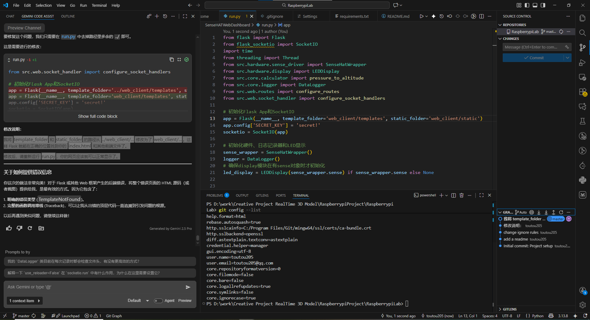

# 欢迎来到树莓派实验室
# Welcome to the Raspberry Pi Lab

这是一个充满奇思妙想的创意空间！
This is a creative space full of imaginative ideas!

本项目中的所有程序都是通过 "vibe coding" 流程开发，旨在快速将灵感变为现实。我们主要使用 **树莓派 3B** 作为核心，并结合各种有趣的传感器和外设来构建和测试各种创意项目。
All programs in this project are developed through a "vibe coding" process, aiming to quickly turn inspiration into reality. We primarily use the **Raspberry Pi 3B** as the core, combined with various interesting sensors and peripherals to build and test creative projects.

## 趣味项目列表
## Fun Projects

以下是我们正在进行或已完成的项目：
Below is a list of projects we are currently working on or have completed:

- **[@SenseHATWebDashboard](./SenseHATWebDashboard/)**
  - **中文**: 一个基于 Web 的实时仪表盘，用于监控和控制树莓派 Sense HAT 传感器数据，并支持 3D 模型实时同步。
  - **English**: A web-based real-time dashboard for monitoring and controlling Raspberry Pi Sense HAT sensor data, with support for real-time 3D model synchronization.

---